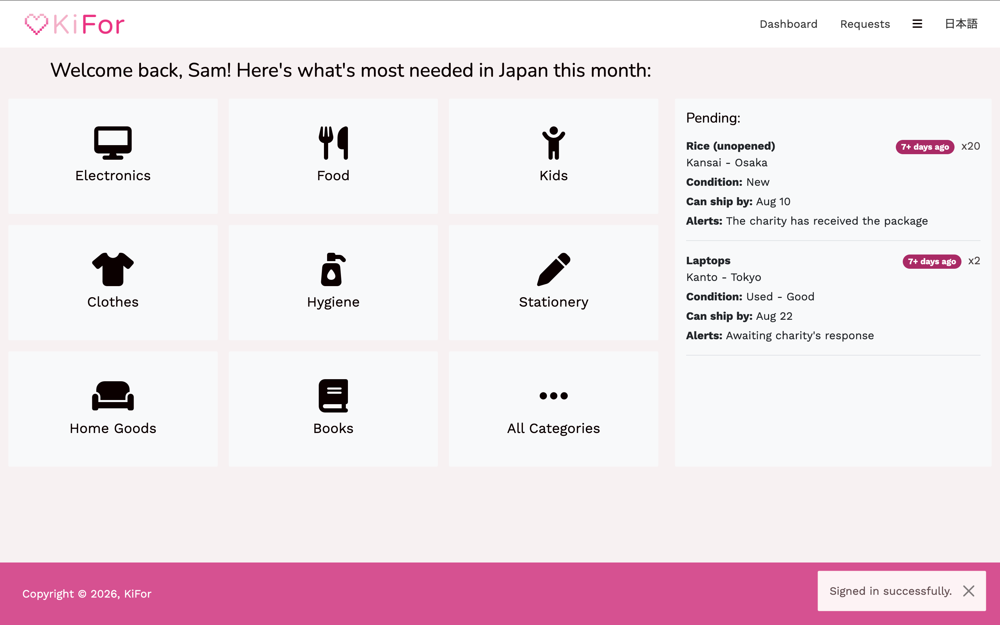
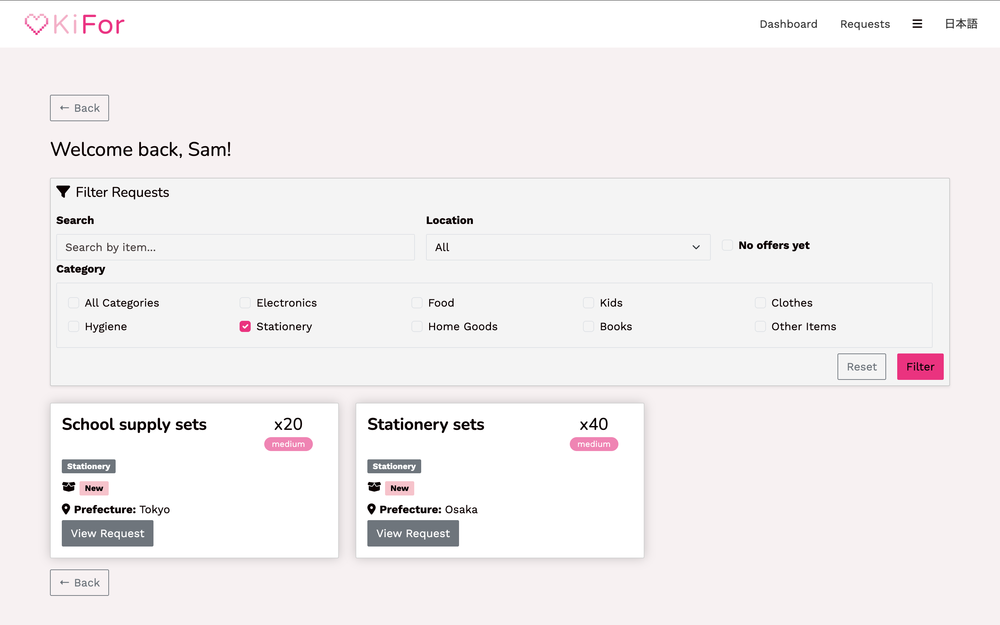
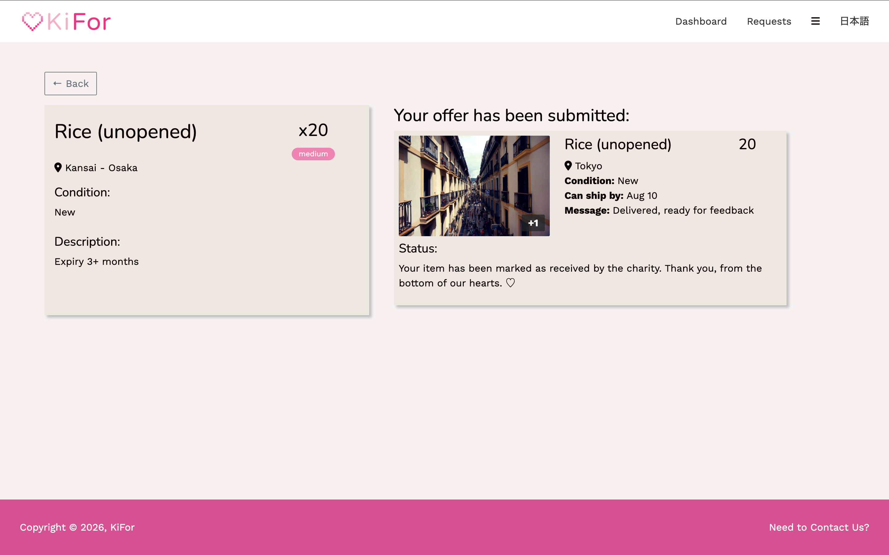

  

  <h3>TECH FOR GOOD</h3>

  

    Built for <a href="https://www.kifor.jp"><strong>KiFor</strong></a>, a Japan-based charity connecting donors with the causes that need them.
  

  

    
  

---

## About

KiFor Match aims to bring charities and donors together.

By providing a safe and anonymous platform, charities can advertise their needs, donors can search by location and urgency, and then send off goods.

Our website is the only platform bringing the nation together with an easy to onboard and use format.

Currently at the MVP stage.

## Features

Charities can post their needs online, specifying the amount, and location. Donors can freely browse and either buy what is needed, or ship goods that they do not need.

Shipping works through anonymous labels.

Charities can see which donors have made offers, and then choose the best option matching their needs.

Through checklists and images, KiFor Match aims to minimize the sending of broken or dirty goods, ensuring that those in need are treated humanely.

## Screenshots

*The donor dashboard, showing open requests sorted by category.*

*Stationery dashboard, showing filtered results.*

*An offer awaiting charity approval.*

## Tech Stack

## Contributors

Nine people built KiFor Match:

## Contact

- **Charity:** KiFor — [www.kifor.jp](https://www.kifor.jp)
- **Founder:** Francis — [LinkedIn](https://www.linkedin.com/in/francisjapan/)
- **Repository:** [github.com/kwood6319/kifor-match](https://github.com/kwood6319/kifor-match)
